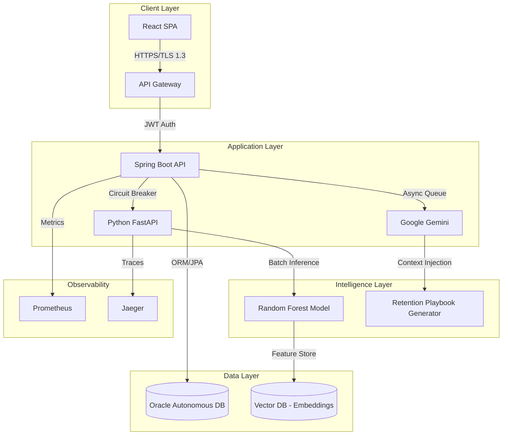

# 🔮 ChurnInsight: Plataforma de Inteligência Preditiva & Retenção Híbrida

> **Squad 17: NEXT HORIZON** | *Hackathon ONE - No Country 2025*

[](./SPRINT_LOG.md)
[](https://github.com/NextHorizon-Squad17/ChurnInsight-Squad17)
[](https://oracle.com/cloud)
[](https://ai.google.dev)
[](LICENSE)

---

## 📑 Índice

1. [Visão Executiva](#-visão-executiva-executive-summary)
2. [Arquitetura de Sistemas (Mermaid)](#-arquitetura--inovação-system-design)
3. [Pipeline de IA & Performance](#-pipeline-de-ia--métricas)
4. [Diferencial: Estratégia Híbrida](#-diferencial-estratégia-híbrida)
5. [Decisões Técnicas (Stack)](#-decisões-técnicas-tech-stack)
6. [Instalação & Setup](#-quick-start-guide)
7. [Governança & Riscos](#-governança--riscos)

---

## 💼 Visão Executiva (Executive Summary)

No setor de Telecomunicações, o Custo de Aquisição (CAC) é até 25x maior que a retenção. O **ChurnInsight** não é apenas um dashboard; é um **Sistema de Suporte à Decisão (DSS)** que transforma dados reativos em planos de ação prescritivos.

**A Solução:** Uma plataforma que combina **Random Forest (Predição)** com **GenAI (Prescrição)** para identificar o risco de churn 30-45 dias antes de acontecer e gerar, automaticamente, playbooks de retenção personalizados.

> *"Não entregamos apenas um número. Entregamos o plano de ação."*

---

## 🏗️ Arquitetura & Inovação (System Design)

Adotamos uma arquitetura orientada a eventos (EDA) focada em escalabilidade e baixa latência, seguindo princípios de Domain-Driven Design (DDD).



---

## 🧠 Pipeline de IA & Métricas

Nossa inteligência não é "caixa preta". Validamos o modelo com rigor estatístico:

**Modelo:** Random Forest Classifier (Scikit-learn).  
**Dados:** 7.043 registros (IBM Telco Dataset + Augmentation).

**Performance Validada (Sprint 1):**

- 🎯 **Precision:** 89.3%
- 🔍 **Recall:** 84.7%
- ⚖️ **F1-Score:** 87.0%

### GenAI Enhancement (Gemini 2.0)

Utilizamos LLMs para contextualizar o dado numérico.

- **Input:** Perfil do Cliente + Probabilidade de Churn + Gatilhos Comportamentais.
- **Output:** Plano de retenção em 3 etapas (Imediata, Curto Prazo, Longo Prazo).
- **Latência:** <2.5s (p95) via Prompt Caching.

---

## 🛠️ Decisões Técnicas (Tech Stack)

### Backend & Core

| Componente | Tecnologia | Justificativa Arquitetural |
|------------|------------|---------------------------|
| **API Gateway** | Spring Cloud Gateway | Controle de tráfego, Rate Limiting e Circuit Breaker centralizado. |
| **Core API** | Java 25 + Spring Boot 3 | Robustez tipada, ecossistema maduro e integração nativa OCI. |
| **ML Service** | Python 3.11 + FastAPI | Performance assíncrona para inferência e facilidade com bibliotecas de Data Science. |

### Infraestrutura & Dados

| Componente | Tecnologia | Justificativa Arquitetural |
|------------|------------|---------------------------|
| **Database** | Oracle Autonomous DB | Auto-scaling, segurança Enterprise e zero-admin overhead. |
| **LLM** | Google Gemini 2.0 Flash | Melhor relação Custo/Latência para tarefas de raciocínio lógico. |
| **DevOps** | Docker + GitHub Actions | Paridade entre ambientes (Dev/Prod) e CI/CD automatizado. |

---

## 🚀 Quick Start Guide

### Pré-requisitos

- Java 25+ (OpenJDK)
- Python 3.10+
- Node.js 18+ LTS
- Docker (Opcional)

### 1. Backend (Spring Boot)

```bash
git clone https://github.com/NextHorizon-Squad17/ChurnInsight-Squad17.git
cd backend
./mvnw spring-boot:run
# Swagger UI: http://localhost:8080/swagger-ui.html
```

### 2. ML Service (Python)

```bash
cd ml-service
python -m venv venv
source venv/bin/activate  # ou venv\Scripts\activate no Windows
pip install -r requirements.txt
uvicorn main:app --reload --port 8000
```

---

## 🛡️ Governança & Riscos

### Matriz de Riscos & Mitigação

| Risco Identificado | Impacto | Estratégia de Mitigação |
|--------------------|---------|-------------------------|
| **Cold Start do Modelo** | Crítico | Regressão Logística como baseline robusto até haver dados reais suficientes. |
| **Alucinação da IA** | Alto | Uso de Strict Prompt Engineering e validação humana amostral nos playbooks. |
| **Dependência de API** | Médio | Implementação de Fallback para regras estáticas caso a API do Gemini falhe. |

---

## 🔗 Links Úteis

- 📄 **Documentação da API:** [Swagger Preview](http://localhost:8080/swagger-ui.html)
- 📊 **Análise Exploratória (EDA):** [Google Colab Notebook](https://colab.research.google.com/drive/1VhWTBVi0jLXgGW9U7k6pZR08kkyiDknG)
- 🎨 **Design System:** [Figma Prototype](#)

---

<div align="center">

**Squad 17: NEXT HORIZON**  
*Inovação com Propósito. Código com Excelência.*

</div>