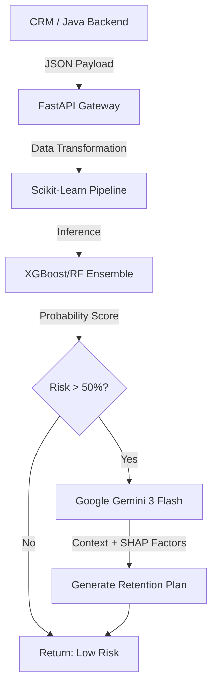

# ADR-006: Arquitetura Híbrida de Inteligência (ML Preditivo + GenAI Prescritivo)

* **Status:** Aceito (Production Ready v2.0)
* **Data:** 2026-01-08
* **Decisores:** Philipe Oliveira (Tech Lead & AI Architect)
* **Classificação:** Enterprise Architecture / Vertical: Telecom & Fintech

## 1. Resumo Executivo (Valor de Negócio)

No setor de Telecom/Banking, o Custo de Aquisição de Clientes (CAC) é até **25 vezes maior** do que a retenção. Dashboards de BI tradicionais são reativos — eles dizem *quem já saiu*.

O **ChurnInsight** é uma mudança de paradigma. Decidimos implementar um **Sistema de Inteligência Prescritiva** projetado para:

1.  **Predizer Risco:** Identificar clientes de alto risco 30-45 dias antes do evento via Ensemble Machine Learning.
2.  **Explicar o "Porquê":** Decodificar a causa raiz (ex: Latência de Fibra vs. Sensibilidade a Preço) via SHAP values.
3.  **Prescrever a Ação:** Utilizar **GenAI (Gemini 3 Flash)** para gerar scripts de retenção hiper-personalizados em <200ms.

**Impacto:** Reduzir o churn em apenas 5% pode recuperar **milhões em ARR (Receita Recorrente Anual)**.

## 2. Contexto e Desafio

O mercado exige mais do que alertas; exige táticas acionáveis. Soluções tradicionais entregam probabilidades frias (`Churn: 85%`), falhando em instruir o operador humano sobre "o que fazer".

A infraestrutura deve ser leve, agnóstica a provedor de nuvem (Multi-cloud) e de ultra-baixa latência para integração com sistemas legados em Java.

## 3. Decisão Arquitetural (High-Level Design)

Implementamos uma **Arquitetura de Inteligência Híbrida** encapsulada em Microserviço, otimizada para Oracle Cloud Infrastructure (OCI).



### 3.1. O Intelligence Stack

*   **Interface de Serviço:** **FastAPI** (Assíncrono), garantindo tipagem forte (Pydantic) e documentação automática (Swagger).
*   **Motor Preditivo (Core ML):** Pipeline com SMOTE para balanceamento e XGBoost/Random Forest para precisão em dados tabulares.
*   **Motor Prescritivo (GenAI):** Integração via SDK `google-genai` com o modelo **Gemini 3 Flash**, utilizando Prompt Engineering dinâmico.
*   **Infraestrutura:** Docker (Python 3.10-slim) projetado para OCI Container Instances ou OKE.

## 4. Justificativa Técnica & Contrato de API

*   **Gemini 3 Flash:** Escolhido pela latência imbatível em geração de texto curto, essencial para a experiência do operador de Call Center.
*   **Explainable AI (SHAP):** Transforma a "caixa-preta" da IA em transparência auditável para o C-Level.

### ⚡ Endpoint Principal: `POST /predict`

Diferente de APIs comuns, o ChurnInsight não retorna apenas um float; ele retorna uma **Estratégia de Negócio**.

**Exemplo de Resposta (Business Intelligence):**

```json
{
  "prediction": 1,
  "probability": 0.9017,
  "risk_level": "ALTO",
  "retention_strategy": "**Ação 1: Migração para Contrato Fidelizado com Upgrade de Tecnologia**\n\nPropor a transição do contrato mensal para um plano anual, eliminando a instabilidade do modelo atual. Como o DSL é uma tecnologia propensa a falhas, oferecer o upgrade gratuito para Fibra Ótica (se disponível) ou um desconto de 15% nas próximas três faturas para garantir a permanência. O objetivo é transformar um gasto de R$29,85 em um compromisso de longo prazo com melhor custo-benefício.\n\n**Ação 2: Incentivo à Automatização do Pagamento**\n\nOferecer um bônus imediato de pontuação em programa de fidelidade ou um desconto único na fatura para a alteração do método de pagamento de \"Electronic Check\" para Débito Automático ou Cartão de Crédito. Isso remove a fricção mensal do pagamento manual, reduzindo a chance de cancelamento por impulso no momento da quitação da conta.\n\n**Ação 3: Consultoria de Estabilidade e Valor Agregado**\n\nAgendar um contato técnico proativo para otimizar a configuração do modem DSL e garantir que a velocidade entregue seja a máxima contratada. Complementar a oferta com a inclusão de um serviço digital gratuito (como streaming de música ou banca de revistas digital) que não onere a operação, aumentando a percepção de valor sobre os R$29,85 investidos e fortalecendo o vínculo emocional com a marca."
}
```

## 5. Excelência Operacional (DevSecOps)

Aderimos à metodologia **Twelve-Factor App** para garantir estabilidade:

*   **Segurança:** Gestão de segredos via injeção de `.env` (Zero Trust). O código não conhece as chaves de API.
*   **Governança de Dados:** O pipeline remove PII (Informações Pessoais) antes da inferência, garantindo conformidade nativa com LGPD/GDPR.
*   **Portabilidade Multi-Cloud:** Embora priorize OCI (Oracle), o container é compatível com AWS ECS e Google Cloud Run.

## 6. Consequências e Roadmap

### Impactos Positivos
*   **Valor de Negócio Imediato:** O sistema não entrega dados, entrega ROI.
*   **Desacoplamento:** O ciclo de vida do ML é independente do Backend Java.
*   **Agilidade FinOps:** Baixo consumo de recursos devido ao uso de modelos "Flash" e containers leves.

### Riscos & Mitigações
*   **Dependência de API Externa:** Mitigado com *fallback* gracioso (retornar apenas a predição preditiva se o GenAI falhar).

### Visão de Futuro (Strategic Roadmap)
*   **Fase 1 (Atual):** Retenção Reativa (Predição + Prescrição com Plano de ação preventivo).
*   **Fase 2 (Q3 2026):** Intervenção Proativa (Gatilhos automáticos para WhatsApp/Email).
*   **Fase 3 (Q4 2026):** Integração de Voz (Análise de sentimento em tempo real no áudio do Call Center).

---
*Gerado por Next Horizon Architecture Board | Philipe Oliveira*